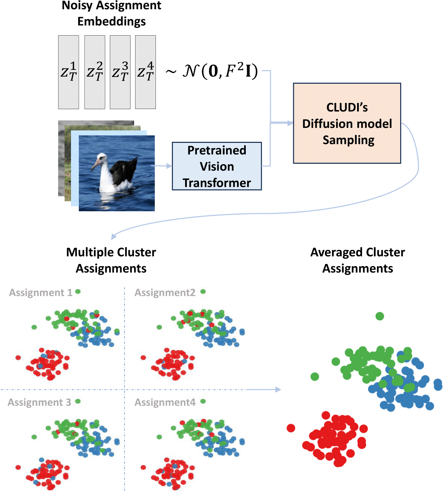

# Clustering via Self‑Supervised Diffusion  

[](https://arxiv.org/abs/2507.04283)



## How to use

### Image embeddings

For generating image embeddings for different pretrained models and datasets, we follow the TEMI pipeline from  
[TEMI-official-BMVC2023](https://github.com/HHU-MMBS/TEMI-official-BMVC2023).

Concretely, we rely on their `gen_embeds.py` script to extract features for a given architecture and dataset, e.g.:

```bash
python gen_embeds.py --arch clip_ViT-B/32 --dataset CIFAR10 --batch_size 256
```

```bash
python cludi.py --num_clusters 50
```

---

## Citation
If you find this work useful, please cite:

```bibtex
@inproceedings{uziel2025clustering,
  title     = {Clustering via Self-Supervised Diffusion},
  author    = {Uziel, Roy and Chelly, Irit and Freifeld, Oren and Pakman, Ari},
  booktitle = {International Conference on Machine Learning},
  year      = {2025},
}
